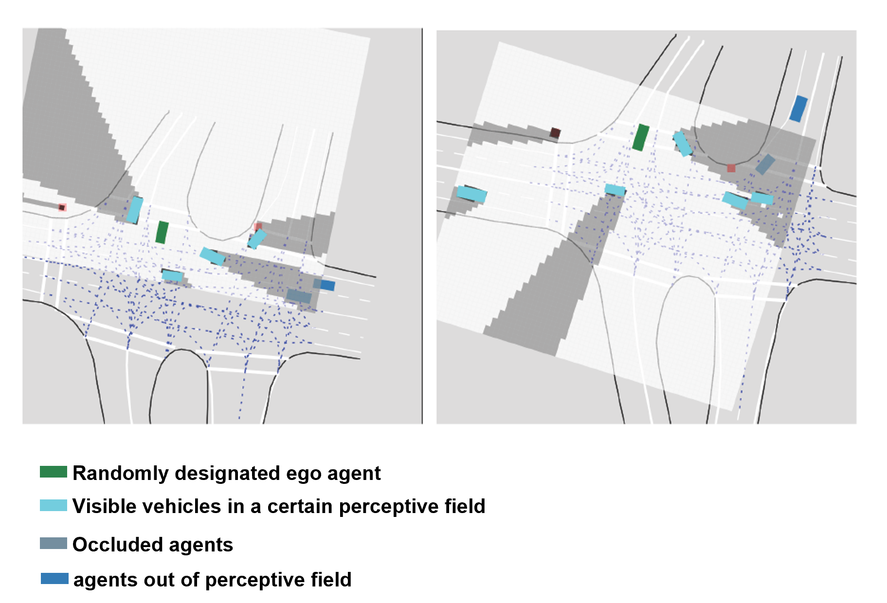

# AutoBots with random masking pretraining

### [paper](https://arxiv.org/abs/2309.08989) | [main page](https://github.com/KTH-RPL/RMP)
<!-- | [video](tbd) -->

This repository is the implementation of the ["RMP: A Random Mask Pretrain Framework for Motion Prediction"](https://arxiv.org/abs/2309.08989) framework, using AutoBots-joint as one example. 


As the previous AutoBots provide, there are support for the following datasets:
- [nuScenes](https://www.nuscenes.org/nuscenes)
- [Argoverse](https://www.argoverse.org/av1.html)
- [Interaction-Dataset](https://interaction-dataset.com/)


## Getting Started
1. Install Mamba to accelerate conda installation speed.
2. Create a python 3.7 environment. I use Miniconda3 and create with 
`mamba env create -f requirements.yaml`

That should be it!

## Setup the datasets
Follow the Autobot's way to process the raw dataset. Find them in the READMEs of each dataset (found in `datasets`). We provide the preprocessed pickle file [here](https://kth-my.sharepoint.com/:f:/g/personal/yiya_ug_kth_se/Evqmv1mmxKRKosj521GLrioBXTAoMKU9im5lWZQi0uBS-A?e=3hW56G). Save them, and update the `dataset_path` in the config file.


## Train
```
python -m torch.distributed.launch --nproc_per_node=[4] --node_rank=0 --nnodes=1 --master_port=[port] \
train.py --config_file config/[config_file_path]
```
(use 4 gpus to train as an example)

### nuScenes
Random mask pretraining,
```
python -m torch.distributed.launch --nproc_per_node=[4] --node_rank=0 --nnodes=1 --master_port=[port] \
train.py --config_file config/nus_mask_pretrain.yaml
```

For random masking, parameter `mask_strategy` in the config file can change among `pointwise`, `patchwise`, `time-only`. Moreover,  `mask_ratio` (from 0-1), `max_patch_size`, `max_patch_size` can further tuned for ablation study.

After pretraining, use the saved pretrained weight and update `ckpt_path` in the config file.

Fine tune on motion prediction. Given all track's historical tracks, to predict target's future path.
```
python \
python -m torch.distributed.launch --nproc_per_node=[4] --node_rank=0 --nnodes=1 --master_port=xxx \
train.py --config_file config/nus_motion_prediction.yaml
```

Fine tune on contional motion prediction. Given all track's historical tracks +  ego vehicle's desired future tracks, to predict all other agents' future paths.
```
python \
python -m torch.distributed.launch --nproc_per_node=[4] --node_rank=0 --nnodes=1 --master_port=xxx \
train.py --config_file config/nus_condition_prediction.yaml
```

### Argoverse, INTERACTION
Same as nuScenes. Change the config yaml file according to different tasks.

## Evaluate
For all experiments, you can evaluate the trained model on the validation dataset by simply chaning the `task` in the config file from `train` to `eval`.

Note that the batch-size may need to be reduced for the Interaction-dataset since evaluation is performed on all agent scenes.

### Evaluate performance in scenarios with occlusions
To test how the random mask pretrain can help predictions in the occluded scenairos, we postprocess the INTERACTION DR-multi v1.2 validation data. As Argoverse and nuScenes data are collected from the ego driving vehicle, they do not cover occluded areas; INTERACTION, instead, is collected by drones and potential traffic cameras, which enables the potential to label occluded objects from the perspective of a single vehicle.

We auto-labeled occluded objects in the validation dataset based on a randomly designated ego agent, following [MultiAgentVariationalOcclusionInference](https://github.com/sisl/MultiAgentVariationalOcclusionInference).
From a bird's-eye view, and given the positions and sizes of all agents, we compute the occupancy grid, objects within the occluded region are labeled as occluded in dark blue.

During evaluation, the network can only access the agent's waypoints labeled as visible. For the agents that are partially occluded , the network can only see incomplete history. We then measure how the network can capture such partially occluded agents' future trajectories.

<center>

</center>

Pretrain with `interaction_mask_pretrain.ymal`, fine-tune motion prediction with `interacton_motion_prediction.ymal`. Eval with `interaction_eval_occlusion.yaml` for occluded scenarios (update `dataset_path` with the processed validation data folder).


Download the processed validation data as [csv files](https://kth-my.sharepoint.com/:f:/g/personal/yiya_ug_kth_se/EksBr3IHOGlOoMAbFXmlAC4B2mPrXETOShVg5OVjWVtTTw?e=paeQVb) or [hdf5 file](https://kth-my.sharepoint.com/:u:/g/personal/yiya_ug_kth_se/EYoayeoDCKREmNmridmX5OcB5exi-nGAeZITuO_zt9c-Xg?e=4O3WE8).


## Model zoo
| tasks                         | dataset     |
|-------------------------------|-------------|
|  Marginal motion   prediction | [nuScenes   ](https://kth-my.sharepoint.com/:u:/g/personal/yiya_ug_kth_se/EcwSb62H7yBDsWLeWBCkVDUB-676tlUmsCliiArmOLIRgg?e=KfN1Uu) |
|                               | [Argoverse  ](https://kth-my.sharepoint.com/:u:/g/personal/yiya_ug_kth_se/EQ8bP7bmEtVHn_XTCGAuUYwBU7sU_KOLVIbl4Bk6iCrlcg?e=AX0Fow) |
|                               | [INTERACTION](https://kth-my.sharepoint.com/:u:/g/personal/yiya_ug_kth_se/EcsclxyNwaVDvdiGECRMzmEBiHfLYYCiqLiYio3GgDrVvQ?e=TT61Z2) |
| Conditional motion prediction | [nuScenes   ](https://kth-my.sharepoint.com/:u:/g/personal/yiya_ug_kth_se/EagRJrFPawFEv4enLS1iItsBLpkgPiUuTamJceGqv0Mz3g?e=I29RKe) |
|                               | [Argoverse  ](https://kth-my.sharepoint.com/:u:/g/personal/yiya_ug_kth_se/EcfIatgtK4VLiduVF_m2GVUBfBglLxASnQGwglF24luCkQ?e=mylt5l) |
